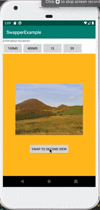

[](https://bintray.com/levibostian/Swapper/com.levibostian.swapper/_latestVersion)
[](https://github.com/levibostian/Swapper-Android/blob/master/LICENSE)

# Swapper

Swap between many different Android Views within your app quick and easy.


*iOS developer? Check out [the iOS version of Swapper!](https://github.com/levibostian/swapper-ios)*

## What is Swapper?

You know those moments in your app when you have a `RecyclerView` that has no rows to show? You know those moments when you perform a HTTP network request and you want to show a non-blocking loading view to the user? These are very common scenarios for mobile apps. Swapper is an Android `View` that allows you to swap between a set of other `Views`s with just 1 line of code.



## Why use Swapper?

* Kotlin API
* Lightweight. Zero dependencies.
* UI testing friendly.
* Setup with default values that should work for 95% of your use cases. Fully customizable for those other cases.

I recommend you check out 2 other libraries that work nicely with Swapper: [Empty](https://github.com/levibostian/Empty-Android) and [PleaseHold](https://github.com/levibostian/PleaseHold-Android).

## Installation

To install Swapper, simply add the following line to your `build.gradle` file:

```
implementation 'com.levibostian.swapper:swapper:version-goes-here'
```

Replace `version-here` with: [](https://bintray.com/levibostian/Swapper/com.levibostian.swapper/_latestVersion) which is the latest version at this time.

## Getting started

* Add an instance of `SwapperView` to your layout. Add all of the views that you want to swap between as children of `SwapperView`.

```xml
<?xml version="1.0" encoding="utf-8"?>
<LinearLayout xmlns:android="http://schemas.android.com/apk/res/android"
    android:layout_width="match_parent"
    android:layout_height="match_parent">

    <com.levibostian.swapper.SwapperView
        android:id="@+id/swapper_view"
        android:layout_width="match_parent"
        android:layout_height="match_parent">

        <ImageView
            android:id="@+id/first_view"
            android:layout_width="match_parent"
            android:layout_height="match_parent"/>

        <ImageView
            android:id="@+id/second_view"
            android:layout_width="match_parent"
            android:layout_height="match_parent"/>
    </com.levibostian.swapper.SwapperView>

</LinearLayout>
```

*Note: The views you want to swap between must be children of `SwapperView`.*

*Note: You can programmatically add more children into `SwapperView`. It's just a `ViewGroup`. Doing it in XML is just easier.*

* Setup the `SwapperView` with a map of the views that you want to swap between:

```kotlin
class MainActivity: AppCompatActivity() {

    // You do not need to an enum as the IDs for Swapper, but it's recommended to avoid typos
    enum class SwapperViews {
        FIRST_VIEW,
        SECOND_VIEW
    }

    override fun onCreate(savedInstanceState: Bundle?) {
        super.onCreate(savedInstanceState)

        setContentView(R.layout.activity_main)

        setupViews()
    }

    private fun setupViews() {
        swapper_view.apply {
            viewMap = mapOf(
                // `first_view` and `second_view` are children of the `SwapperView`.
                // Here, we are mapping an ID to each view.
                Pair(SwapperViews.FIRST_VIEW.name, first_view),
                Pair(SwapperViews.SECOND_VIEW.name, second_view)
            )
            // When `SwapperView` initializes, it hides all of it's children by default. You must call `swapTo()` to swap to your first view.
            swapTo(SwapperViews.FIRST_VIEW.name) {}
        }
    }

}
```

* That's it! Now, when you want to Swapper to transition from the currently shown view to another one, call `swapTo(id)`. Swapper will then show the View for you. Swapper will even fade out the currently shown view and fade in the new view for you for a nice touch 👌. If you want to override the default animation, you can!

## Customize Swapper

#### Set animation duration

* Set the default animation duration used for all instances of `SwapperView`:

```kotlin
// Value is in milliseconds
SwapperView.config.animationDuration = 100
```

* Or, you can override the default for each instance of `SwapperView`:

```kotlin
swapper_view_instance.animationDuration = 500
```

#### Set the animation between the old and new view

* Set the default animation lambda used for all instances of `SwapperView`:

```kotlin
SwapperView.config.swapAnimator = { oldView, newView, duration, onComplete ->
    // Start animations here. When the animations are done running, call `onComplete()`
}
```

* Or, you can override the default for each instance of `SwapperView`:

```kotlin
swapper_view_instance.swapAnimator = { oldView, newView, duration, onComplete ->
   // Start animations here. When the animations are done running, call `onComplete()`
}
```

## Example

Swapper comes with an example app you can use to play with the library. To run the example project, clone the repo and then open it up in Android Studio.

## Development

Swapper is a pretty simple Android library project. At this time, all you need to do is open up the project in Android Studio and you are ready to go!

## Author

* Levi Bostian - [GitHub](https://github.com/levibostian), [Twitter](https://twitter.com/levibostian), [Website/blog](http://levibostian.com)


## Contribute

Swapper is open for pull requests. Check out the [list of issues](https://github.com/levibostian/Swapper-android/issues) for tasks I am planning on working on. Check them out if you wish to contribute in that way.

**Want to add features to Swapper?** Before you decide to take a bunch of time and add functionality to the library, please, [create an issue](https://github.com/levibostian/Swapper-android/issues/new) stating what you wish to add. This might save you some time in case your purpose does not fit well in the use cases of Swapper.

## License

Swapper is available under the MIT license. See the LICENSE file for more info.